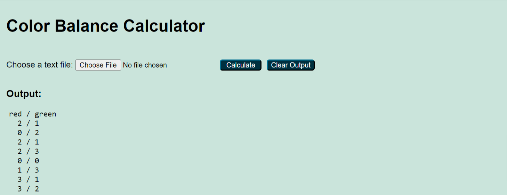

# Color Balance Calculator
This project is a spring boot web application which recieves a file consisting of DNA sequences and calculates the Color-Balance of them.

The source code can be find under the [src](src) directory. 
Unit tests are provided in [test](src/test) directory.

After cloning the project you can run the project by runnig [ColorBalanceCalculatorApplication.java](src/main/java/com/example/colorbalancecalculator/ColorBalanceCalculatorApplication.java)

By visiting `http://localhost:8080/home` you can see the home page of the application. You can find a screen shot below.

By using the "Choose File" button you can upload a text file of DNA sequences. Each line in the file represents a DNA sequence.
Each DNA sequence should only contain "G, T, C, A" characters (case insensitive), separated by a space. Lines should not contain any numbers.

The sequences below show a valid file content:

     G T C A G T C A
     A G T A G T A C
     C T C T G A C A

If your file is valid by clicking on "Calculate" button, you can see the calculated Color-Balance of DNA sequences.
Below you can see a screen shot of the output for the DNA sequences shown above.

In case of uploading an invalid text file you will see an error message on the screen. Below is an example.

